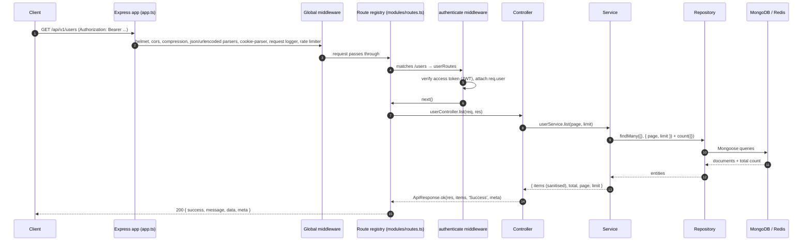
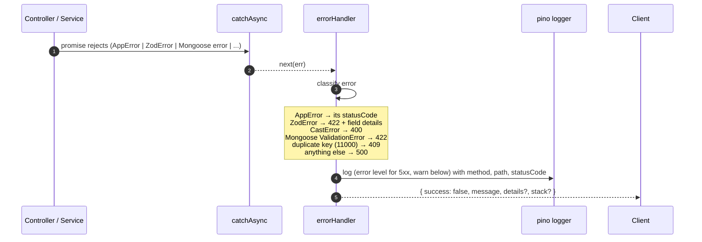
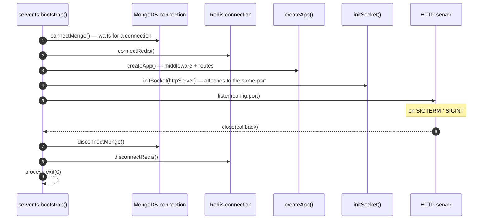
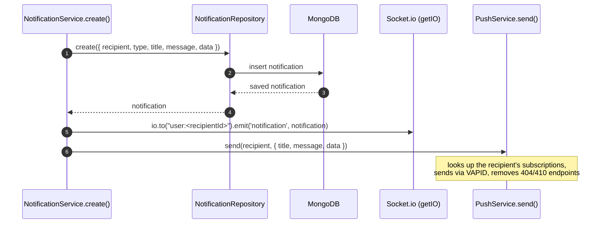

# Architecture Overview

This document walks through how a request flows through Nodist, how errors are handled, and how the real-time and web-push paths fit in. It's a map of the moving parts, not a line-by-line tour — read the code alongside it.

## The layers

Nodist is a layered Express app with a few deliberate rules:

1. **Controllers don't do business logic.** They parse the request, call a service, and hand the result to `ApiResponse`.
2. **Services don't know about Express.** They throw typed errors (`AppError` subclasses) and return plain results.
3. **Repositories don't know about Mongoose schemas... beyond the model they wrap.** Every repository extends `BaseMongoRepository`, so CRUD and pagination are inherited; modules only add the queries that are specific to them.
4. **Everything converges on one response shape.** `ApiResponse` produces `{ success, message, data, meta? }`; the error handler produces `{ success: false, message, details?, stack? }`.

## Request lifecycle

This is the happy path for, say, `GET /api/v1/users`:

The `validate` middleware slots in where routes declare a Zod schema. It parses `{ body, query, params }` against the schema, replaces the request fields with the parsed output, and hands control on. A parse failure throws a `ZodError` before the controller ever runs.

Static files are served before the API routes, so `public/sw.js` is available at `/sw.js` without touching the API prefix.

## Error handling

Every async controller is wrapped in `catchAsync`, so a rejected promise becomes `next(err)` instead of an unhandled rejection. From there, one error handler does all the work:

The mapping table in the handler is the full story:

| Error | Status | Body extras |
| ----- | ------ | ----------- |
| `AppError` subclasses (BadRequest, Unauthorized, Forbidden, NotFound, Conflict, Validation, TooManyRequests, InternalServerError) | their own (400–500) | `details` if provided |
| `ZodError` | 422 | `details` keyed by field, e.g. `{ email: ["Invalid email"] }` |
| Mongoose `CastError` | 400 | – |
| Mongoose `ValidationError` | 422 | `details` as an array of messages |
| Mongo duplicate key (code 11000) | 409 | `details` = the offending key/value |
| Unknown `Error` | 500 | `stack` in dev, generic message in production |

Requests that end in an error are logged here with their status — the request logger itself stays silent for 4xx/5xx, so you don't get the same failure twice.

Routes that match nothing fall through to `notFoundHandler`, which produces a `404 { success: false, message: "Route GET /x not found" }` through the same path.

## Bootstrap and shutdown

`server.ts` owns the process lifecycle:

`unhandledRejection` and `uncaughtException` trigger the same shutdown path, and a 10-second timer forces an exit if anything hangs. Environment variables are validated before any of this — `config/env.ts` exits the process on invalid config, which is why the server never boots half-configured.

## Real-time notifications

Notifications are written to Mongo, emitted over socket.io, and delivered as web push — in that order, with the last two being best-effort:

Both the socket emit and the web push are wrapped in try/catch — a failure there logs and never breaks notification creation. The welcome notification is created when the user's email is first verified (see `AuthService.verifyEmail`), which is a nice end-to-end example of this flow firing.

## Why this structure?

Three reasons, in order of importance:

- **Copy-paste onboarding.** A new feature module is a copy of `src/modules/user` with the names changed. The base repository, error classes, validation middleware and route registry already exist, so the plumbing for a new CRUD module is essentially free.
- **Testability.** Services and repositories depend on interfaces (`IUserRepository`, `INotificationRepository`), not on Mongoose directly. Swapping in a fake repository for tests is a constructor call away.
- **Small, reviewable diffs.** Each module is self-contained, so a feature PR touches one folder plus the one-line entry in `modules/routes.ts`. Merges rarely collide.
